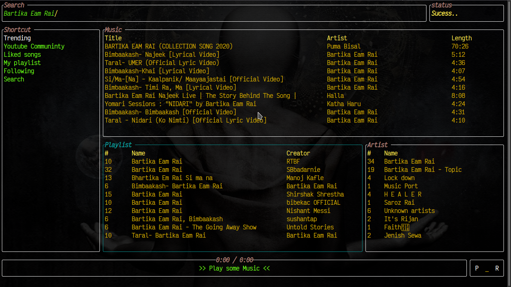
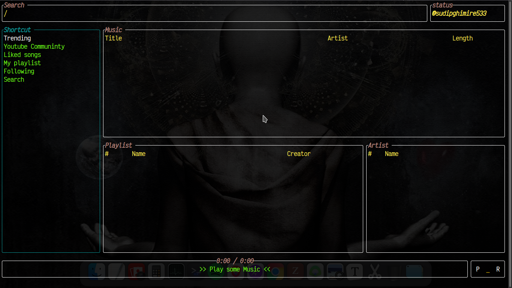
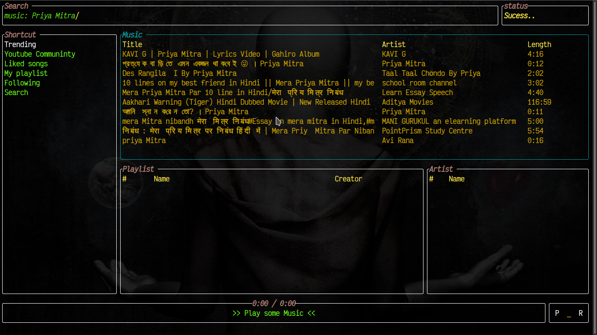
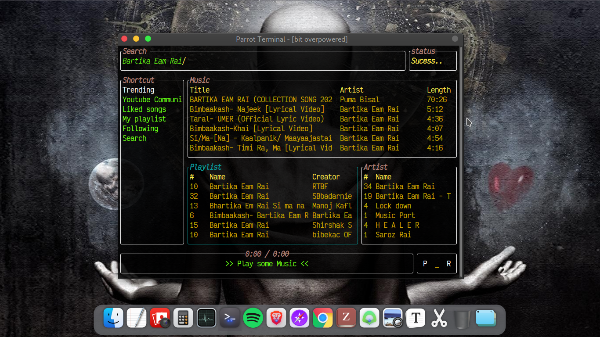
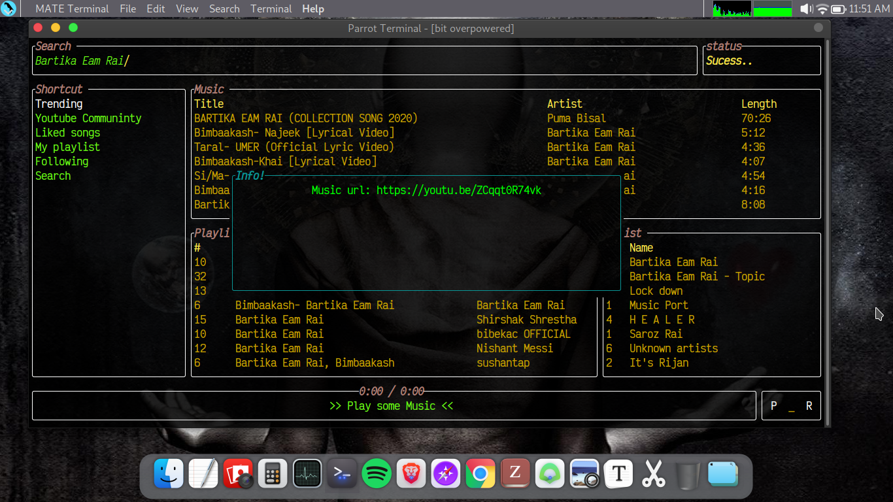
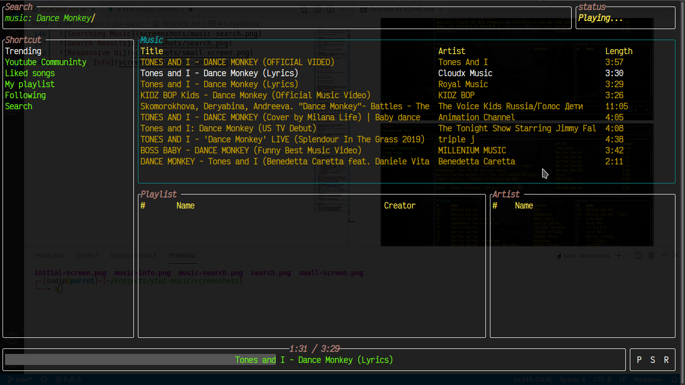

# Ytui-music
Listen to music from youtube inside terminal with sleek tui



## [See more screenshots](#screenshots)

---

# Installation
NOTE: since the dependency `libmpv` seems not to be maintained anymore,

you will probably need to build from source in any platform. See section *Build From Source* below.

1) Download latest binary from [release page](https://github.com/sudipghimire533/ytui-music/releases/latest).
If binary is not available for your platform, head on to [build from source](#building-from-source)

2) Give it executable permission and from downloaded directory, in shell:
```
ytui_music run
```
3) You may need to jump to [Usage Guide](#usage)

---

## Dependencies
Ytui-music depends on mpv and youtube-dl. You may refer to the official websites of [mpv](https://mpv.io) and [youtube-dl](https://yt-dl.org).

If you have `choco` for windows or `brew` in mac or one of popular package manager in Linux you may run:

### - Windows (In powershell or cmd)
```
choco install mpv youtube-dl
```

### - Mac
```
brew install mpv youtube-dl
```

### - Debian/Ubuntu Derivatives
```
sudo apt update -y
sudo apt install -y youtube-dl libmpv1 libmpv-dev
```
**For other distributions, install youtube-dl and mpv packages in your preferred methods**

---

# Before running ytui-music
Before you start with ytui-music, make sure that the following directory exists and that you have write permission to ytui-music in order to save configuration file.
## Windows
`C:\Users\<username>\AppData\Roaming` or anv var `{FOLDERID_RoamingAppData}`

## Mac
`/Users/<username>/Library/Application Support` or  `$HOME/Library/Application Support`

## Linux
`$HOME/.config/` or `/home/<username>/.config` or env var `$XDG_CONFIG_HOME`

---

# Building from Source
Ytui-music is written entirely in Rust and building it from source is dead simple. All you have to do is download source, install rust and build with cargo.

1) Installing rust. Head to [Rust installation](https://www.rust-lang.org/tools/install). It is basically doing
```
curl --proto '=https' --tlsv1.2 -sSf https://sh.rustup.rs | sh
```
2) Get the source code. You can [download from the archives]() or use git clone:
```
git clone git@github.com:sudipghimire533/ytui-music
```

3) `cd` into source root and do:
```
git submodule init
MPV_BUILD=mpv-build/ cargo build --all --release --features build_libmpv
```

4) The compiled binary is located in `target/release/` directory. Copy the `ytui_music` binary and place it somewhere where it is easy to run. Preferrably under `$PATH`.

5) Ytui-music is now ready to fire. [Head over to usage](#usage)

---

# Usage

ytui-music is single binary so it shouldn't be difficult to run. Just make sure you have [installed the required dependencies](#dependencies).

### Run ytui-music
```
ytui_music run
```
### Show help message
```
ytui_music help
```
### Show current configured shortcuts
```
ytui_music info shortcuts
```
### Show version information
```
ytui_music infor version
```

## Searching
1) Press `/` to go to search box
2) Type
    - `music:Bartika Eam Rai` to search only for music result for query "Bartika Eam Rai"
    - `playlist:Soft pop hits` to search only for playlist for query "Soft pop hits"
    - `artist:Bibash Jk` to search only for artist for query "Bibash Jk"
    - `Coding music` to search all of playlist, music and artist at once for query "Coding music"
3) Press `Enter` key

## Navigating
- Use `Left arrow` or `Backspace` for backward and `Right arrow` or `Tab` key for forward to **move between Sidebar, Musicbar, Playlistbar and Artistbar**
- Use `Up arrow` or `Down arrow` to move up or down in the list which will **highlight the list item**
- Press `Enter` key to **select an item**

## Playback control
- Press `Space` key **to pause/unpause the playback**
- Press `s` key to **toggle suffle/unsuffle**
- Press `r` key to **repeat single or all item in playlist**
- Press `>` for forward and `<` for backward **playback seek**
- Press `CTRL+n` for next and `CTRL+p` to **change track**

## Downloading
1) Highlight the item you want to download. Currently downloading of music and playlist is supported.
2) Press `CTRL+d` to **download the selection**

## Quitting
- Press `CTRL+c` to **quit ytui-music**
- If download is ongoing, press `CTRL+ALT+C` to force quit

## Adding to favorites
1) Highlight the item you want to add or remove from favorites
2) Press `f` to add or `u` to remove from favorites
3) To see your list
    - Favorite music are shown in `Liked` section in sidebar
    - Favorite playlists are shown in `My playlist` section in sidebar
    - Favorite artists are shown in `Following` section in sidebar

---

# Screenshots
This is what ytui-music looks like. It may even look better on yours. ;)
<details>

<summary> Click to see screenshots</sumary>








</details>
